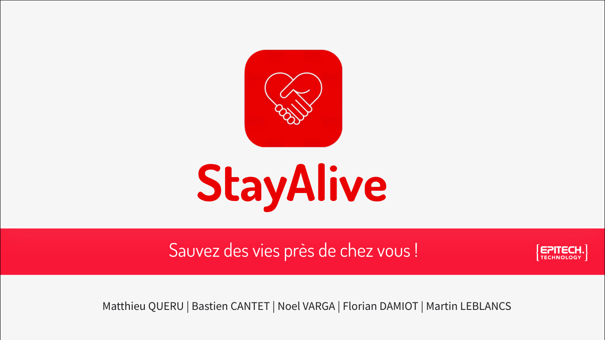

[](https://codecov.io/github/StayAliveEIP/stayalive-mobileapp)
[](https://github.com/StayAliveEIP/stayalive-mobileapp/actions/workflows/BuildApk.yml)
[](https://github.com/StayAliveEIP/stayalive-mobileapp/actions/workflows/BuildTest.yml)

<div id="top"></div>
<br />
<div align="center">
  <a href="https://github.com/StayAliveEIP/stayalive-mobileapp">
    
  </a>

<h3 align="center">StayAlive Mobile App</h3>
Here is the Mobile application repository.<br/> You will find all the source code for our Stayalive mobile application
</div>
<details>
  <summary>Table of Contents</summary>
  <ol>
    <li>
      <a href="#about-the-project">About The Project</a>
      <ul>
        <li><a href="#built-using">Built Using</a></li>
      </ul>
    </li>
    <li>
        <a href="#prerequisites">Prerequisites</a>
    </li>
    <li>
        <a href="#installation">Installation</a>
    </li>    
    <li>
    <a href="#commit-norm">Commit norm</a>
    </li>
    <li> 
    <a href="#our-group">Our group</a>
    </li>

</ol>
</details>

# About The Project

<div align="center">
    
</div>

<p align="center">
StayAlive is a mobile application that allows emergency services such as SAMU to notify a community of verified doctors, nurses, and rescuers to intervene in an emergency within 3 minutes of their location. The goal is to reduce emergency response times and increase the survival rate of patients affected by a cardiac arrest.    <br />
<br/>
</p>

### Built using:

- [React-Native](https://reactnative.dev)

# Prerequisites

- [Node.JS(Version 14.x.x and newer)](https://nodejs.org/en)
- [npm](https://www.npmjs.com)
- [React Native CLI](https://reactnative.dev/docs/environment-setup)

# Installation

Clone the repo

```sh
- git clone git@github.com:StayAliveEIP/stayalive-mobileapp.git
- npm i
- npm run build
- npx react-native start
- npx react-native run-android
```

# Commit norm

When adding something:

```sh
[ADD] Adding this
```

When fixing something:

```sh
[FIX] Fixing this
```

When deleting something:

```sh
[DEL] Deleting this
```

When working on something:

```sh
[WIP] Work in progress
```

# Our group

| Name            | GitHub                 | Working on |
| --------------- | ---------------------- | ---------- |
| Martin LEBLANCS | [MartinLeblancs][GhML] | Mobile APP |
| Noel VARGA      | [noelvarga25][GhNV]    | Mobile APP |
| Matthieu QUERU  | [Matthieu33197][GhMQ]  | Web APP    |
| Bastien CANTET  | [bastosbob][GhBC]      | API        |
| Florian DAMIOT  | [florianepitech][GhFD] | API        |
| Felix BUISSON   | [felixbuisson][GhFB]    | Web Admin  |

[//]: # 'These are the links used above'
[GhML]: https://github.com/MartinLeblancs
[GhMQ]: https://github.com/Matthieu33197
[GhNV]: https://github.com/noelvarga25
[GhBC]: https://github.com/bastosbob
[GhFD]: https://github.com/florianepitech
[GhFB]: https://github.com/FelixBuisson

<p align="right">(<a href="#top">back to top</a>)</p>
